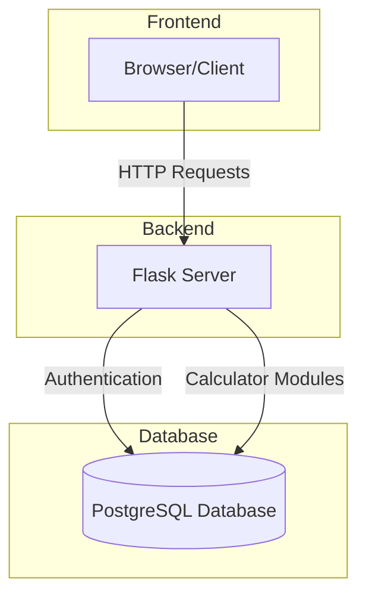
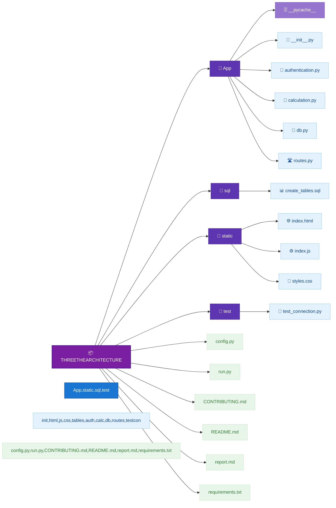

# Advanced Calculator Web Application

A full-stack web application featuring a scientific calculator with user authentication and calculation history tracking.

## Features

- **User Authentication**: Secure login and registration system
- **Basic Calculator**: Standard arithmetic operations
- **Scientific Calculator**: Advanced mathematical functions including:
  - Derivatives
  - Integrals
  - Limits
  - Equation solving
  - Trigonometric functions
- **Calculation History**: Saves and displays recent calculations
- **Responsive Design**: User-friendly interface for all devices

## Tech Stack

- **Frontend**: HTML, CSS, JavaScript
- **Backend**: Python, Flask
- **Database**: PostgreSQL
- **Mathematical Engine**: SymPy

## Architecture



## Screenshots

```
[SCREENSHOT PLACEHOLDER - Login Screen]
```

```
[SCREENSHOT PLACEHOLDER - Calculator Interface]
```

```
[SCREENSHOT PLACEHOLDER - History Panel]
```

## Setup Instructions

1. Clone the repository
2. Install requirements:

   ```
   pip install -r requirements.txt
   ```

3. Configure database connection in `config.py`
4. Initialize the database:

   ```
   python -c "from app.db import init_db; init_db()"
   ```

5. Run the application:

   ```
   python run.py
   ```

## Project Structure



## Database Schema

```mermaid
uerDiagram
    USERS ||--o{ CALCULATION_HISTORY : "1-to-many"
    USERS {
        int id PK
        string username
        string password_hash
        timestamp created_at
    }
    CALCULATION_HISTORY {
        int id PK
        int user_id FK
        string operation
        string expression
        string result
        timestamp created_at
    }
```

## API Endpoints

| Endpoint                       | Method | Description                    |
| ------------------------------ | ------ | ------------------------------ |
| `/api/authentication/login`    | POST   | User login                     |
| `/api/authentication/register` | POST   | User registration              |
| `/api/authentication/logout`   | POST   | User logout                    |
| `/api/authentication/history`  | GET    | Get user's calculation history |
| `/api/calculate`               | POST   | Process calculation requests   |

## Future Enhancements(may do it)

- Graph plotting
- Matrix operations
- Statistical functions
- Dark mode theme
- Export calculations to PDF/CSV

## License

MIT License

Copyright (c) 2025 Chouaib reffs,...

Permission is hereby granted, free of charge, to any person obtaining a copy
of this software and associated documentation files, to deal
in the Software without restriction, including without limitation the rights
to use, copy, modify, merge, publish, distribute, sublicense, and/or sell
copies of the Software, and to permit persons to whom the Software is
furnished to do so, subject to the following conditions:

The above copyright notice and this permission notice shall be included in all
copies or substantial portions of the Software.

THE SOFTWARE IS PROVIDED "AS IS", WITHOUT WARRANTY OF ANY KIND, EXPRESS OR
IMPLIED, INCLUDING BUT NOT LIMITED TO THE WARRANTIES OF MERCHANTABILITY,
FITNESS FOR A PARTICULAR PURPOSE AND NONINFRINGEMENT. IN NO EVENT SHALL THE
AUTHORS OR COPYRIGHT HOLDERS BE LIABLE FOR ANY CLAIM, DAMAGES OR OTHER
LIABILITY, WHETHER IN AN ACTION OF CONTRACT, TORT OR OTHERWISE, ARISING FROM,
OUT OF OR IN CONNECTION WITH THE SOFTWARE OR THE USE OR OTHER DEALINGS IN THE
SOFTWARE.
