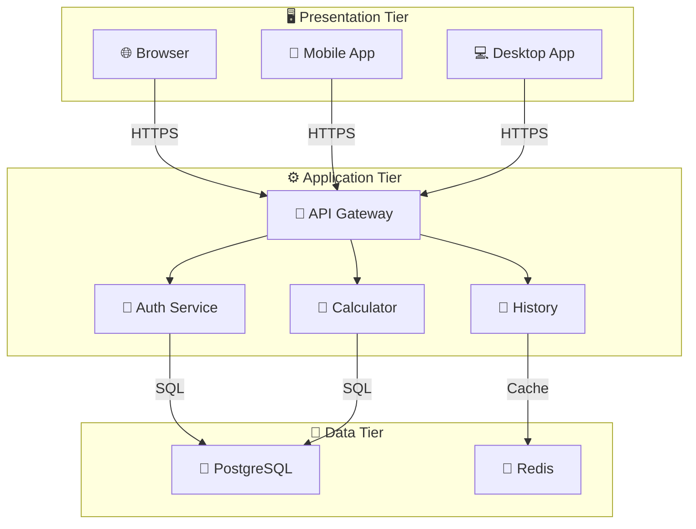
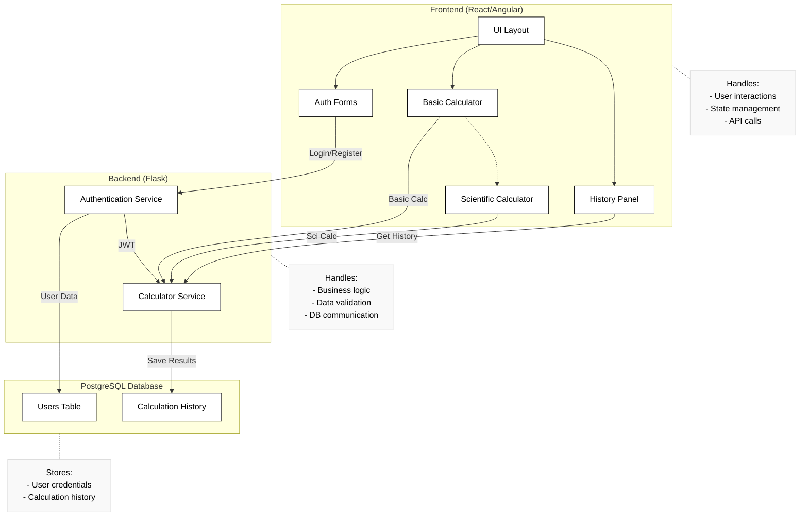
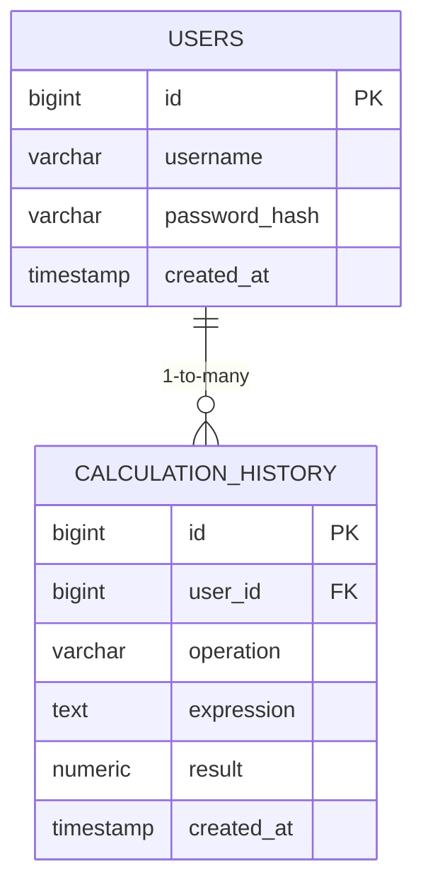
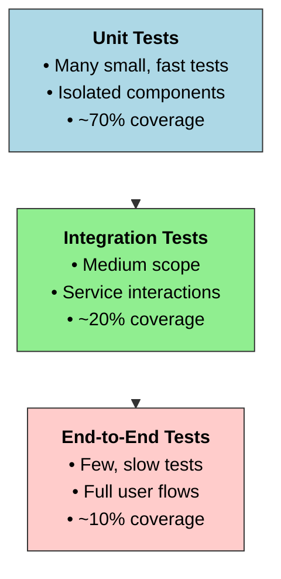
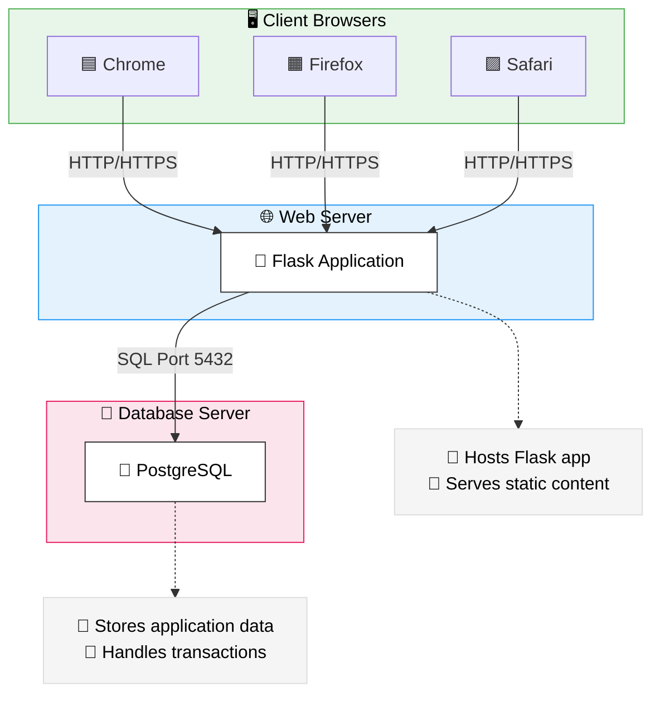

# Advanced Scientific Calculator Web Application
## Project Technical Report

## 1. Executive Summary

This project implements a full-stack web application that provides an advanced scientific calculator with user authentication and calculation history tracking. The calculator supports basic arithmetic operations as well as complex mathematical functions including derivatives, integrals, limits, and equation solving through an intuitive user interface.

The application employs modern development practices with a clear separation of concerns, secure user authentication, and a responsive design that works across different devices. This solution demonstrates integration between frontend web technologies and a Python-based backend with a PostgreSQL database.


## 2. System Architecture

### 2.1 Architecture Overview

The project follows a three-tier architecture:



### 2.2 Component Breakdown



## 3. Implementation Details

### 3.1 Authentication System

The system implements a secure user authentication mechanism that:
- Uses bcrypt for password hashing
- Manages user sessions
- Provides registration, login, and logout functionality
- Enforces authentication through function decorators

Key code from authentication.py:
```python
@auth_bp.route('/login', methods=['POST'])
def login():
    data = request.get_json()
    username = data.get('username')
    password = data.get('password')

    user_id = verify_user(username, password)
    if user_id:
        session['username'] = username
        session['user_id'] = user_id
        return jsonify({"success": True, "message": f"Welcome, {username}!"})
    else:
        return jsonify({"success": False, "message": "Invalid username or password"}), 401
```

### 3.2 Calculator Engine

The calculator leverages SymPy, a Python library for symbolic mathematics, to perform complex calculations:

- Derivative calculations
- Indefinite integrals
- Limits calculation
- Equation solving
- Function evaluation

Key code from calculator.py:
```python
from sympy import symbols, diff, integrate, limit, Eq, solve, sympify

x = symbols('x')

def calculate_derivative(expr_str):
    expr = sympify(expr_str)
    return str(diff(expr, x))

def calculate_integral(expr_str):
    expr = sympify(expr_str)
    return str(integrate(expr, x))
```

### 3.3 Database Layer

The application uses PostgreSQL with structured tables for user management and calculation history:



SQL creation script:
```sql
CREATE TABLE IF NOT EXISTS users (
    id SERIAL PRIMARY KEY,
    username TEXT NOT NULL UNIQUE,
    password_hash TEXT NOT NULL,
    created_at TIMESTAMP DEFAULT CURRENT_TIMESTAMP
);

CREATE TABLE IF NOT EXISTS calculation_history (
    id SERIAL PRIMARY KEY,
    user_id INTEGER REFERENCES users(id),
    operation TEXT,
    expression TEXT,
    result TEXT,
    created_at TIMESTAMP DEFAULT CURRENT_TIMESTAMP
);
```

### 3.4 API Endpoints

The application exposes the following REST API endpoints:

| Endpoint | Method | Purpose | Authentication Required |
|----------|--------|---------|------------------------|
| `/api/authentication/login` | POST | User login | No |
| `/api/authentication/register` | POST | User registration | No |
| `/api/authentication/logout` | POST | User logout | Yes |
| `/api/authentication/history` | GET | Get calculation history | Yes |
| `/api/calculate` | POST | Perform calculations | Yes |

### 3.5 Frontend Implementation

The frontend is built with HTML, CSS, and vanilla JavaScript:

- Responsive layout that adapts to different screen sizes
- Two calculator modes: Basic and Scientific
- Modal dialogs for complex inputs (e.g., limit values)
- History panel with interactive elements

```mermaid

    stateDiagram-v2
    [*] --> Login
    Login --> Registration: "Register link clicked"
    Registration --> Login: "Back to login"
    
    Login --> BasicCalculator: "Successful login"
    
    state "Basic Calculator" as BasicCalculator #lightblue
    state "Scientific Mode" as ScientificMode #ffcccb
    state "History Panel" as HistoryPanel #fffacd
    state "Limit Input Modal" as LimitInputModal #f0e68c
    
    state BasicCalculator {
        [*] --> DefaultView
        DefaultView --> ScientificMode: "Switch to scientific"
        ScientificMode --> DefaultView: "Switch to basic"
        
        DefaultView --> HistoryPanel: "View history"
        ScientificMode --> HistoryPanel: "View history"
        HistoryPanel --> DefaultView: "Close history"
        HistoryPanel --> ScientificMode: "Close history"
        
        state LimitInputModal {
            [*] --> Active
            Active --> Resolved: "Valid input"
            Resolved --> [*]
        }
        
        DefaultView --> LimitInputModal: "Invalid input"
        ScientificMode --> LimitInputModal: "Invalid input"
    }
    
    %% Color definitions
    Login #90ee90
    Registration #ffb6c1
    BasicCalculator #add8e6
    ScientificMode #ffcccb
    HistoryPanel #fffacd
    LimitInputModal #f0e68c
    
    note right of BasicCalculator
        <b>Color Guide:</b>
        <span style='color:#90ee90'>Login</span>,
        <span style='color:#ffb6c1'>Registration</span>,
        <span style='color:#add8e6'>Calculator</span>,
        <span style='color:#ffcccb'>Scientific</span>,
        <span style='color:#fffacd'>History</span>,
        <span style='color:#f0e68c'>Modal</span>
    end note

```



## 4. Key Features

### 4.1 Mode Switching

The calculator offers two distinct modes:
- Basic mode: For simple arithmetic operations
- Scientific mode: For advanced mathematical functions

Users can switch between modes without losing their input, providing flexibility based on calculation needs.

### 4.2 Expression Handling

The application handles mathematical expressions in different ways:
- Basic calculations are processed client-side for immediate feedback
- Complex operations are sent to the backend for processing with SymPy
- Special handling for equations and multi-valued results

### 4.3 History Management

The system maintains a record of user calculations:
- Each user has their own private calculation history
- History is limited to the 5 most recent calculations
- Users can click on history items to reload them into the calculator
- History is synchronized with the database

## 5. Security Considerations

### 5.1 Password Security
- All passwords are hashed using bcrypt before storage
- Original passwords are never stored in the database
- Password comparison is done securely via bcrypt's compare function

### 5.2 Session Management
- User sessions are managed via Flask's session mechanism
- Authentication state is verified for protected routes
- Session data is stored securely

### 5.3 Input Validation
- All user inputs are validated both client-side and server-side
- Parameterized SQL queries prevent SQL injection attacks
- Error handling prevents exposure of sensitive information

## 6. Testing Strategy



### 6.1 Unit Testing
- Individual functions tested in isolation
- Calculator operations tested with various inputs
- Authentication functions verified with mock data

### 6.2 Integration Testing
- API endpoints tested with sample requests
- Database operations verified with test database
- User workflows validated across components

### 6.3 End-to-End Testing
- Complete user journeys tested from frontend to database
- Authentication flow validation
- Calculator operations through the UI

## 7. Deployment Architecture

The application is designed for deployment on various platforms:



### 7.1 Deployment Options
- Traditional server deployment with Gunicorn/uWSGI
- Containerized deployment with Docker
- Cloud deployment on platforms like Heroku, AWS, or Google Cloud

### 7.2 Scaling Considerations
- Horizontal scaling for web servers
- Database connection pooling
- Caching for frequently accessed data

## 8. Challenges and Solutions

### 8.1 Complex Mathematical Processing
**Challenge**: Implementing advanced mathematical operations
**Solution**: Leveraged SymPy library for symbolic mathematics

### 8.2 User Experience
**Challenge**: Creating an intuitive interface for both basic and scientific operations
**Solution**: Implemented mode switching with consistent UI elements

### 8.3 Session Management
**Challenge**: Maintaining user authentication state
**Solution**: Implemented secure session handling with Flask

## 9. Future Enhancements

The following features could be implemented in future iterations:

### 9.1 Functionality Enhancements
- Graphing capabilities for functions
- Matrix and vector operations
- Statistical functions and data analysis
- Unit conversion tools

### 9.2 User Experience Improvements
- Dark mode theme
- Customizable key layouts
- Mobile application version
- Keyboard shortcuts for desktop users

### 9.3 Technical Improvements
- Offline capability with service workers
- Performance optimizations for complex calculations
- Export and import functionality for calculation history
- Social sharing of calculations

## 10. Conclusion

The Advanced Scientific Calculator web application successfully demonstrates a modern web application architecture that combines frontend technologies with a powerful Python backend. The implementation showcases effective separation of concerns, secure user authentication, and integration with mathematical libraries to deliver a useful tool for various calculation needs.

The project serves as both a practical calculator application and a reference implementation for similar web applications that require user authentication, complex processing, and database integration.

We realy enjoyed working in this project we would like to enhance it if there are any ideas,fill free to add it or contact us or be a contributer yourself  and follow the steps on [CONTRIBUITNG](CONTRIBUTING.md) we had a relly good time and we hope we meet in another adventure

## Appendix

### A. Code Organization

advanced-calculator/
├── app/
│   ├── __init__.py         # Flask application initialization
│   ├── authentication.py   # Authentication routes and functions
│   ├── calculator.py       # Mathematical operation implementations
│   ├── db.py               # Database connection and operations
│   ├── routes.py           # API routes for calculator operations
│
├── static/
│   ├── styles.css          # Application styling
│   ├── index.js            # Frontend JavaScript
│   └── index.html          # Main application HTML
│
├── sql/
│   └── create_tables.sql   # Database creation script
│
├── .env                    # Environment variables (API keys, DB URI, etc.; do NOT commit)
├── requirements.txt        # Python dependencies list for `pip install -r requirements.txt`
├── config.py               # Configuration settings
└── run.py                  # Application entry point

### B. API Documentation

Detailed documentation for each API endpoint:

#### Authentication API

**POST /api/authentication/login**
- Purpose: Authenticate user and create session
- Request body: `{"username": string, "password": string}`
- Response: `{"success": boolean, "message": string}`

**POST /api/authentication/register**
- Purpose: Register new user
- Request body: `{"username": string, "password": string}`
- Response: `{"success": boolean, "message": string}`

**POST /api/authentication/logout**
- Purpose: End user session
- Response: `{"success": boolean, "message": string}`

**GET /api/authentication/history**
- Purpose: Retrieve user's calculation history
- Response: `{"history": [{"operation": string, "expression": string, "result": string}, ...]}`

#### Calculator API

**POST /api/calculate**
- Purpose: Process mathematical operations
- Request body: `{"expression": string, "operation": string, "x_value": number (optional)}`
- Response: `{"result": string or array}`